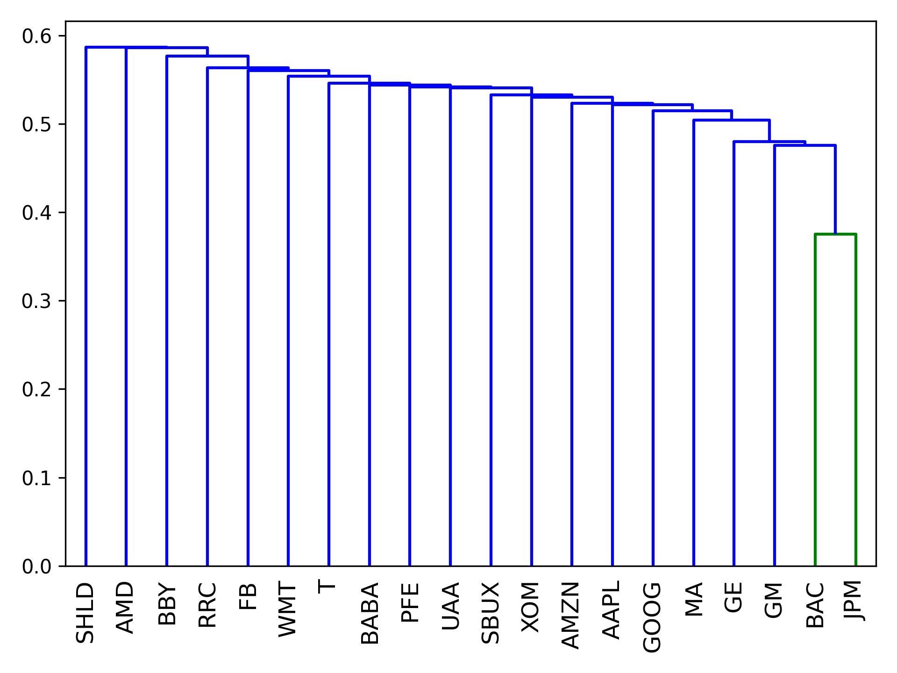
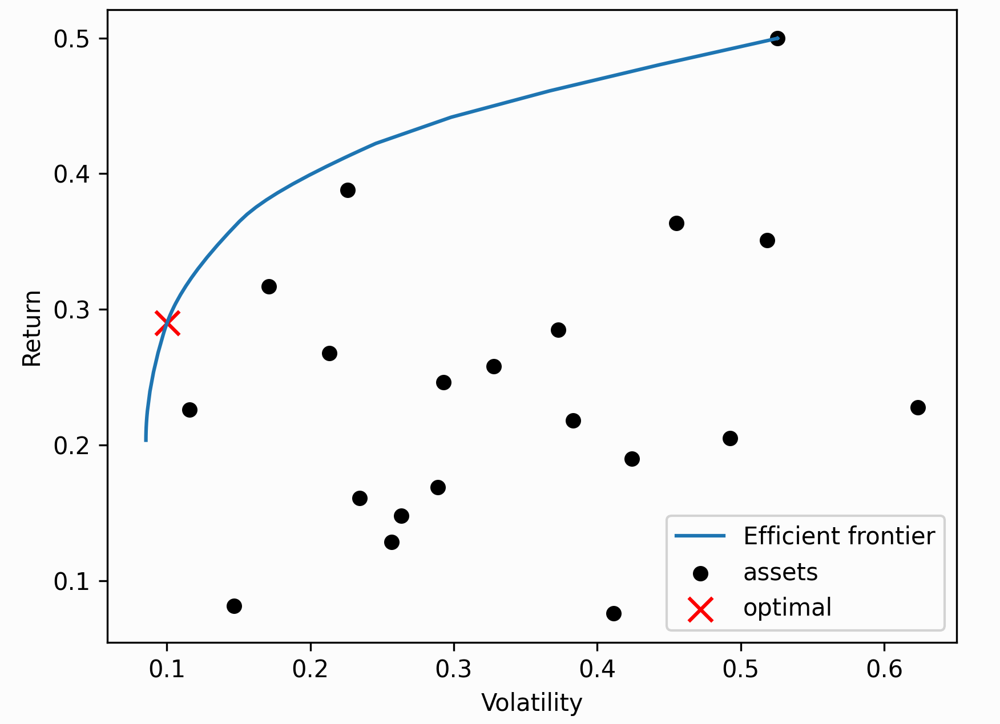

.. _other-optimisers:

################
Other Optimisers
################

In addition to optimisers that rely on the covariance matrix in the style of
Markowitz, recent developments in portfolio optimisation have seen a number
of alternative optimisation schemes. PyPortfolioOpt implements some of these,
though please note that the implementations may be slightly unstable.

.. note::
    As of v0.4, these other optimisers now inherit from ``BaseOptimizer`` or
    ``BaseConvexOptimizer``, so you no longer have to implement pre-processing and
    post-processing methods on your own. You can thus easily swap out, say,
    ``EfficientFrontier`` for ``HRPOpt``.

Hierarchical Risk Parity (HRP)
==============================

Hierarchical Risk Parity is a novel portfolio optimisation method developed by
Marcos Lopez de Prado [1]_. Though a detailed explanation can be found in the
linked paper, here is a rough overview of how HRP works:

1. From a universe of assets, form a distance matrix based on the correlation
   of the assets.
2. Using this distance matrix, cluster the assets into a tree via hierarchical
   clustering
3. Within each branch of the tree, form the minimum variance portfolio (normally
   between just two assets).
4. Iterate over each level, optimally combining the mini-portfolios at each node.

The advantages of this are that it does not require the inversion of the covariance
matrix as with traditional quadratic optimisers, and seems to produce diverse
portfolios that perform well out of sample.

.. automodule:: pypfopt.hierarchical_portfolio

    .. autoclass:: HRPOpt
        :members:
        :exclude-members: plot_dendrogram

        .. automethod:: __init__

.. _cla:

The Critical Line Algorithm
===========================

This is a robust alternative to the quadratic solver used to find mean-variance optimal portfolios,
that is especially advantageous when we apply linear inequalities. Unlike generic quadratic optimisers, 
the CLA is specially designed for portfolio optimisation. It is guaranteed to converge after a certain
number of iterations, and can efficiently derive the entire efficient frontier.

.. tip:: 

    In general, unless you have specific requirements e.g you would like to efficiently compute the entire
    efficient frontier for plotting, I would go with the standard ``EfficientFrontier`` optimiser.

I am most grateful to Marcos López de Prado and David Bailey for providing the implementation [2]_.
Permission for its distribution has been received by email. It has been modified such that it has
the same API, though as of v0.5.0 we only support ``max_sharpe()`` and ``min_volatility()``.

.. automodule:: pypfopt.cla

    .. autoclass:: CLA
        :members:
        :exclude-members: plot_efficient_frontier

        .. automethod:: __init__

Implementing your own optimiser
===============================

Please note that this is quite different to implementing :ref:`custom-optimisation`, because in
that case we are still using the same quadratic optimiser. However, HRP and CLA optimisation
have a fundamentally different optimisation method. In general, these are much more difficult
to code up compared to custom objective functions.

To implement a custom optimiser that is compatible with the rest of PyPortfolioOpt, just
extend ``BaseOptimizer`` (or ``BaseConvexOptimizer`` if you want to use ``cvxpy``),
both of which can be found in ``base_optimizer.py``. This gives you access to utility
methods like ``clean_weights()``, as well as making sure that any output is compatible
with ``portfolio_performance()`` and post-processing methods.

.. automodule:: pypfopt.base_optimizer

    .. autoclass:: BaseOptimizer
        :members:

        .. automethod:: __init__

    .. autoclass:: BaseConvexOptimizer
        :members:
        :private-members:

        .. automethod:: __init__

.. Value-at-Risk
.. =============

.. .. warning::
..     Caveat emptor: this functionality is still experimental. Although I have
..     used the CVaR optimisation, I've noticed that it is very inconsistent
..     (which to some extent is expected because of its stochastic nature).
..     However, the optimiser doesn't always find a minimum, and it fails
..     silently. Additionally, the weight bounds are not treated as hard bounds.

.. The value-at-risk is a measure of tail risk that estimates how much a portfolio
.. will lose in a day with a given probability. Alternatively, it is the maximum
.. loss with a confidence of beta. In fact, a more useful measure is the
.. **expected shortfall**, or **conditional value-at-risk** (CVaR), which is the
.. mean of all losses so severe that they only occur with a probability
.. :math:`1-\beta`.

.. .. math::
..     CVaR_\beta = \frac{1}{1-\beta} \int_0^{1-\beta} VaR_\gamma(X) d\gamma

.. To approximate the CVaR for a portfolio, we will follow these steps:

.. 1. Generate the portfolio returns, i.e the weighted sum of individual asset returns.
.. 2. Fit a Gaussian KDE to these returns, then resample.
.. 3. Compute the value-at-risk as the :math:`1-\beta` quantile of sampled returns.
.. 4. Calculate the mean of all the sample returns that are below the value-at-risk.

.. Though CVaR optimisation can be transformed into a linear programming problem [3]_, I
.. have opted to keep things simple using the `NoisyOpt <https://noisyopt.readthedocs.io/en/latest/>`_
.. library, which is suited for optimising noisy functions.

.. .. automodule:: pypfopt.value_at_risk

..     .. autoclass:: CVAROpt
..         :members:

..         .. automethod:: __init__

..     .. caution::
..         Currently, we have not implemented any performance function. If you
..         would like to calculate the actual CVaR of the resulting portfolio,
..         please import the function from `objective_functions`.

References
==========

.. [1] López de Prado, M. (2016). `Building Diversified Portfolios that Outperform Out of Sample <https://papers.ssrn.com/sol3/papers.cfm?abstract_id=2708678>`_. The Journal of Portfolio Management, 42(4), 59–69.
.. [2] Bailey and Loópez de Prado (2013). `An Open-Source Implementation of the Critical-Line Algorithm for Portfolio Optimization <https://papers.ssrn.com/sol3/papers.cfm?abstract_id=2197616>`_ 
