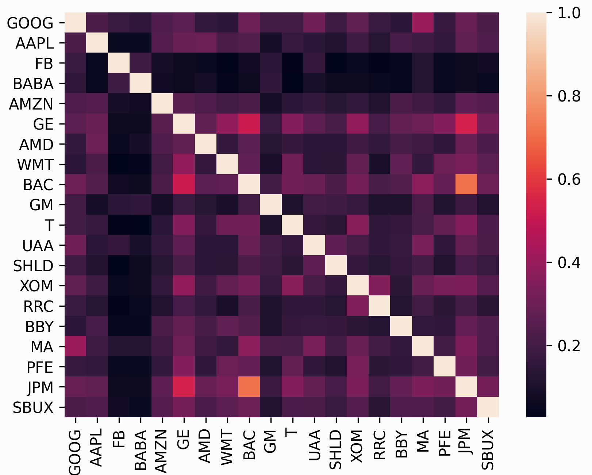

.. _risk-models:

###########
Risk Models
###########

In addition to the expected returns, mean-variance optimization requires a
**risk model**, some way of quantifying asset risk. The most commonly-used risk model
is the covariance matrix, which describes asset volatilities and their co-dependence. This is
important because one of the principles of diversification is that risk can be
reduced by making many uncorrelated bets (correlation is just normalised
covariance).

In many ways, the subject of risk models is far more important than that of
expected returns because historical variance is generally a much more persistent
statistic than mean historical returns. In fact, research by Kritzman et
al. (2010) [1]_ suggests that minimum variance portfolios, formed by optimising
without providing expected returns, actually perform much better out of sample.

The problem, however, is that in practice we do not have access to the covariance
matrix (in the same way that we don't have access to expected returns) – the only
thing we can do is to make estimates based on past data. The most straightforward
approach is to just calculate the **sample covariance matrix** based on historical
returns, but relatively recent (post-2000) research indicates that there are much
more robust statistical estimators of the covariance matrix. In addition to
providing a wrapper around the estimators in ``sklearn``, PyPortfolioOpt
provides some experimental alternatives such as semicovariance and exponentially weighted
covariance.

.. attention::

    Estimation of the covariance matrix is a very deep and actively-researched
    topic that involves statistics, econometrics, and numerical/computational
    approaches. PyPortfolioOpt implements several options, but there is a lot of room
    for more sophistication.

.. automodule:: pypfopt.risk_models

    .. note::

        For any of these methods, if you would prefer to pass returns (the default is prices),
        set the boolean flag ``returns_data=True``

    .. autofunction:: risk_matrix

    .. autofunction:: fix_nonpositive_semidefinite

        Not all the calculated covariance matrices will be positive semidefinite (PSD). This method
        checks if a matrix is PSD and fixes it if not.

    .. autofunction:: sample_cov

        This is the textbook default approach. The
        entries in the sample covariance matrix (which we denote as *S*) are the sample
        covariances between the *i* th and *j* th asset (the diagonals consist of
        variances). Although the sample covariance matrix is an unbiased estimator of the
        covariance matrix, i.e :math:`E(S) = \Sigma`, in practice it suffers from
        misspecification error and a lack of robustness. This is particularly problematic
        in mean-variance optimization, because the optimizer may give extra credence to
        the erroneous values.

        .. note::

            This should *not* be your default choice! Please use a shrinkage estimator
            instead.

    .. autofunction:: semicovariance

        The semivariance is the variance of all returns which are below some benchmark *B*
        (typically the risk-free rate) – it is a common measure of downside risk. There are multiple
        possible ways of defining a semicovariance matrix, the main differences lying in
        the 'pairwise' nature, i.e whether we should sum over :math:`\min(r_i,B)\min(r_j,B)`
        or :math:`\min(r_ir_j, B)`. In this implementation, we have followed the advice of
        Estrada (2007) [2]_, preferring:

        .. math::
            \frac{1}{n}\sum_{i = 1}^n {\sum_{j = 1}^n {\min \left( {{r_i},B} \right)} }
            \min \left( {{r_j},B} \right)

    .. autofunction:: exp_cov

        The exponential covariance matrix is a novel way of giving more weight to
        recent data when calculating covariance, in the same way that the exponential
        moving average price is often preferred to the simple average price. For a full
        explanation of how this estimator works, please refer to the
        `blog post <https://reasonabledeviations.com/2018/08/15/exponential-covariance/>`_
        on my academic website.

    .. autofunction:: cov_to_corr

    .. autofunction:: corr_to_cov

Shrinkage estimators
====================

A great starting point for those interested in understanding shrinkage estimators is
*Honey, I Shrunk the Sample Covariance Matrix* [3]_ by Ledoit and Wolf, which does a
good job at capturing the intuition behind them – we will adopt the
notation used therein. I have written a summary of this article, which is available
on my `website <https://reasonabledeviations.com/notes/papers/ledoit_wolf_covariance/>`_.
A more rigorous reference can be found in Ledoit and Wolf (2001) [4]_.

The essential idea is that the unbiased but often poorly estimated sample covariance can be
combined with a structured estimator :math:`F`, using the below formula (where
:math:`\delta` is the shrinkage constant):

.. math::
    \hat{\Sigma} = \delta F + (1-\delta) S

It is called shrinkage because it can be thought of as "shrinking" the sample
covariance matrix towards the other estimator, which is accordingly called the
**shrinkage target**. The shrinkage target may be significantly biased but has little
estimation error. There are many possible options for the target, and each one will
result in a different optimal shrinkage constant :math:`\delta`. PyPortfolioOpt offers
the following shrinkage methods:

- Ledoit-Wolf shrinkage:

    - ``constant_variance`` shrinkage, i.e the target is the diagonal matrix with the mean of
      asset variances on the diagonals and zeroes elsewhere. This is the shrinkage offered
      by ``sklearn.LedoitWolf``. 
    - ``single_factor`` shrinkage. Based on Sharpe's single-index model which effectively uses
      a stock's beta to the market as a risk model. See Ledoit and Wolf 2001 [4]_. 
    - ``constant_correlation`` shrinkage, in which all pairwise correlations are set to
      the average correlation (sample variances are unchanged). See Ledoit and Wolf 2003 [3]_

- Oracle approximating shrinkage (OAS), invented by Chen et al. (2010) [5]_, which
  has a lower mean-squared error than Ledoit-Wolf shrinkage when samples are
  Gaussian or near-Gaussian.

.. tip::

    For most use cases, I would just go with Ledoit Wolf shrinkage, as recommended by
    `Quantopian <https://www.quantopian.com/>`_ in their lecture series on quantitative
    finance.

My implementations have been translated from the Matlab code on
`Michael Wolf's webpage <https://www.econ.uzh.ch/en/people/faculty/wolf/publications.html>`_, with
the help of `xtuanta <https://github.com/robertmartin8/PyPortfolioOpt/issues/20>`_. 

.. autoclass:: CovarianceShrinkage
    :members:

    .. automethod:: __init__

References
==========

.. [1] Kritzman, Page & Turkington (2010) `In defense of optimization: The fallacy of 1/N <https://www.cfapubs.org/doi/abs/10.2469/faj.v66.n2.6>`_. Financial Analysts Journal, 66(2), 31-39.
.. [2] Estrada (2006), `Mean-Semivariance Optimization: A Heuristic Approach <https://papers.ssrn.com/sol3/papers.cfm?abstract_id=1028206>`_
.. [3] Ledoit, O., & Wolf, M. (2003). `Honey, I Shrunk the Sample Covariance Matrix <http://www.ledoit.net/honey.pdf>`_ The Journal of Portfolio Management, 30(4), 110–119. https://doi.org/10.3905/jpm.2004.110
.. [4] Ledoit, O., & Wolf, M. (2001). `Improved estimation of the covariance matrix of stock returns with an application to portfolio selection <http://www.ledoit.net/ole2.pdf>`_, 10, 603–621.
.. [5] Chen et al. (2010),  `Shrinkage Algorithms for MMSE Covariance Estimation <https://arxiv.org/pdf/0907.4698.pdf>`_, IEEE Transactions on Signals Processing, 58(10), 5016-5029.
