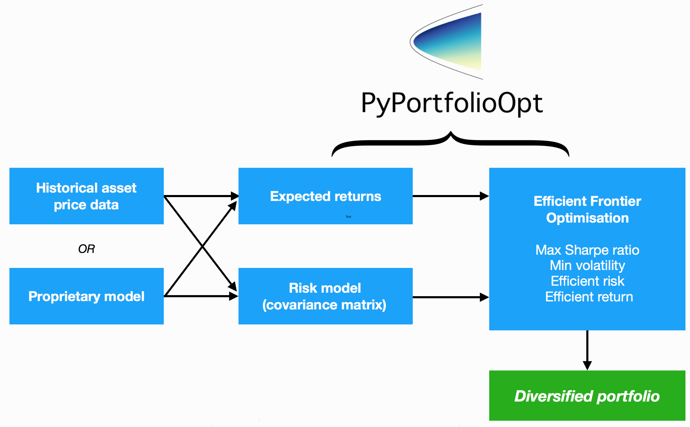

.. _user-guide:

##########
User Guide
##########

This is designed to be a pratical guide, mostly aimed at users who are interested in a quick way of
optimally combining some assets (most likely equities). However, I point out areas that a more advanced
user might like to take note of, as they may be suitable springboards for more advanced optimisation
techniques. Details about the parameters are left for the respective documentation pages (please see
the sidebar). 

PyPortfolioOpt is designed with modulatrity in mind; the below flowchart sums up the current 
functionality and overall layout of PyPortfolioOpt.

Processing historical prices
============================

Efficient frontier optimisation requires two things: the expected returns of the assets, and the 
covariance matrix (or more generally, a *risk model* quantifying asset risk). PyPortfolioOpt provides 
methods for estimating both, but also supports users who would like to use their own models. 
However, I will assume that most users will not have their own models to predict expected returns and 
estimate the covariance matrix (at least for now). In this case, all you need to supply is a dataset of 
historical prices for your assets. This dataset should look something like the one below::

                    XOM        RRC        BBY         MA        PFE        JPM  
    date
    2010-01-04  54.068794  51.300568  32.524055  22.062426  13.940202  35.175220
    2010-01-05  54.279907  51.993038  33.349487  21.997149  13.741367  35.856571
    2010-01-06  54.749043  51.690697  33.090542  22.081820  13.697187  36.053574
    2010-01-07  54.577045  51.593170  33.616547  21.937523  13.645634  36.767757
    2010-01-08  54.358093  52.597733  32.297466  21.945297  13.756095  36.677460

The index should be dates, and each column should represent the timeseries of prices for an asset. A
dataset of real-life stock prices has been included in the `tests folder <https://github.com/robertmartin8/PyPortfolioOpt/tree/master/tests>`_ of the GitHub repo.

Advanced users
==============

I take "Advanced user" to mean anyone who was previously familiar with Modern Portfolio Theory, and
was just looking for an implementation. In that case, there is a bel
