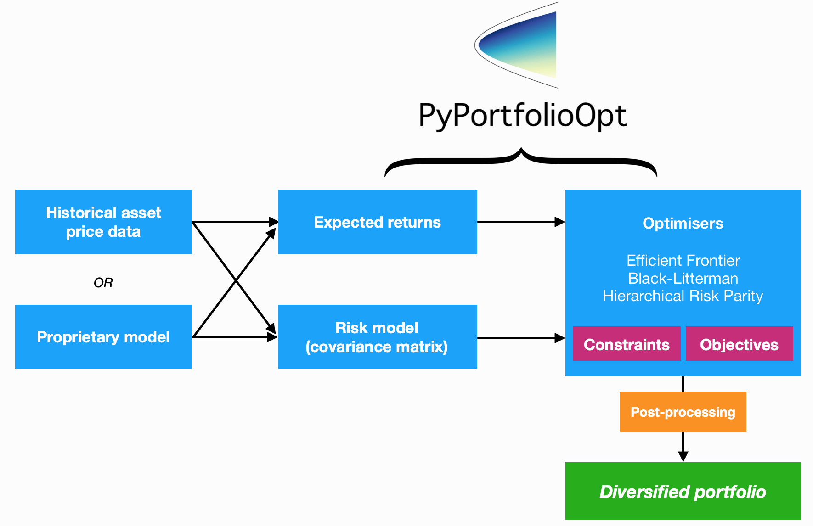
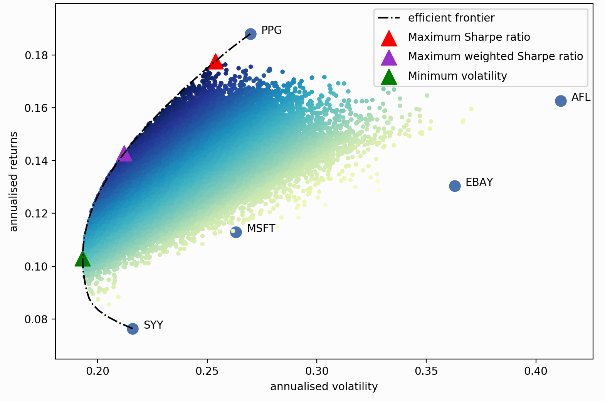

.. _user-guide:

##########
User Guide
##########

This is designed to be a practical guide, mostly aimed at users who are interested in a
quick way of optimally combining some assets (most likely equities). However, when
necessary I do introduce the required theory and also point out areas that may be
suitable springboards for more advanced optimisation techniques. Details about the
parameters can be found in the respective documentation pages (please see the sidebar).

For this guide, we will be focusing on mean-variance optimisation (MVO), which is what
most people think of when they hear "portfolio optimisation". MVO forms the core of
PyPortfolioOpt's offering, though it should be noted that MVO comes in many flavours,
which can have very different performance characteristics. Please refer to the sidebar
to get a feeling for the possibilities, as well as the other optimisation methods
offered. But for now, we will continue with the Efficient Frontier.

PyPortfolioOpt is designed with modularity in mind; the below flowchart sums up the
current functionality and overall layout of PyPortfolioOpt.

Processing historical prices
============================

Efficient frontier optimisation requires two things: the expected returns of the assets,
and the covariance matrix (or more generally, a *risk model* quantifying asset risk).
PyPortfolioOpt provides methods for estimating both (located in
:py:mod:`expected_returns` and :py:mod:`risk_models` respectively), but also supports
users who would like to use their own models.

However, I assume that most users will (at least initially) prefer to use the built-ins.
In this case, all you need to supply is a dataset of historical prices for your assets.
This dataset should look something like the one below::

                    XOM        RRC        BBY         MA        PFE        JPM
    date
    2010-01-04  54.068794  51.300568  32.524055  22.062426  13.940202  35.175220
    2010-01-05  54.279907  51.993038  33.349487  21.997149  13.741367  35.856571
    2010-01-06  54.749043  51.690697  33.090542  22.081820  13.697187  36.053574
    2010-01-07  54.577045  51.593170  33.616547  21.937523  13.645634  36.767757
    2010-01-08  54.358093  52.597733  32.297466  21.945297  13.756095  36.677460

The index should consist of dates or timestamps, and each column should represent the
time series of prices for an asset. A dataset of real-life stock prices has been
included in the `tests folder <https://github.com/robertmartin8/PyPortfolioOpt/tree/master/tests>`_
of the GitHub repo.

.. note::

    Pricing data does not have to be daily, but the frequency should ideally
    be the same across all assets (workarounds exist but are not pretty).

After reading your historical prices into a pandas dataframe ``df``, you need to decide
between the available methods for estimating expected returns and the covariance matrix.
Sensible defaults are :py:func:`expected_returns.mean_historical_return()` and
the Ledoit Wolf shrinkage estimate of the covariance matrix found in
:py:class:`risk_models.CovarianceShrinkage`. It is simply a matter of applying the
relevant functions to the price dataset::

    from pypfopt.expected_returns import mean_historical_return
    from pypfopt.risk_models import CovarianceShrinkage

    mu = mean_historical_return(df)
    S = CovarianceShrinkage(df).ledoit_wolf()

``mu`` will then be a pandas series of estimated expected returns for each asset,
and ``S`` will be the estimated covariance matrix (part of it is shown below)::

            GOOG      AAPL        FB      BABA      AMZN        GE       AMD  \
    GOOG  0.045529  0.022143  0.006389  0.003720  0.026085  0.015815  0.021761
    AAPL  0.022143  0.207037  0.004334  0.002954  0.058200  0.038102  0.084053
    FB    0.006389  0.004334  0.029233  0.003770  0.007619  0.003008  0.005804
    BABA  0.003720  0.002954  0.003770  0.013438  0.004176  0.002011  0.006332
    AMZN  0.026085  0.058200  0.007619  0.004176  0.276365  0.038169  0.075657
    GE    0.015815  0.038102  0.003008  0.002011  0.038169  0.083405  0.048580
    AMD   0.021761  0.084053  0.005804  0.006332  0.075657  0.048580  0.388916

Now that we have expected returns and a risk model, we are ready to move on to the
actual portfolio optimisation.

Efficient Frontier Optimisation
===============================

Efficient Frontier Optimisation is based on Harry Markowitz's 1952 classic paper [1]_, which
turned portfolio management from an art into a science. The key insight is that by
combining assets with different expected returns and volatilities, one can decide on a
mathematically optimal allocation.

If :math:`w` is the weight vector of stocks with expected returns :math:`\mu`, then the
portfolio return is equal to each stock's weight multiplied by its return, i.e
:math:`w^T \mu`. The portfolio risk in terms of the covariance matrix :math:`\Sigma`
is given by :math:`w^T \Sigma w`. Portfolio optimisation can then be regarded as a
convex optimisation problem, and a solution can be found using quadratic programming.
If we denote the target return as :math:`\mu^*`, the precise statement of the long-only
portfolio optimisation problem is as follows:

.. math::

    \begin{equation*}
    \begin{aligned}
    & \underset{w}{\text{minimise}} & & w^T \Sigma w \\
    & \text{subject to} & & w^T\mu \geq \mu^*\\
    &&& w^T\mathbf{1} = 1 \\
    &&& w_i \geq 0 \\
    \end{aligned}
    \end{equation*}

If we vary the target return, we will get a different set of weights (i.e a different
portfolio) – the set of all these optimal portfolios is referred to as the
**efficient frontier**.

Each dot on this diagram represents a different possible portfolio, with darker blue
corresponding to 'better' portfolios (in terms of the Sharpe Ratio). The dotted
black line is the efficient frontier itself. The triangular markers represent the
best portfolios for different optimisation objectives.

The Sharpe ratio is the portfolio's return less the risk-free rate, per unit risk
(volatility).

.. math::
    SR = \frac{R_P - R_f}{\sigma}

It is particularly important because it measures the portfolio returns, adjusted for
risk. So in practice, rather than trying to minimise volatility for a given target
return (as per Markowitz 1952), it often makes more sense to just find the portfolio
that maximises the Sharpe ratio. This is implemented as the :py:meth:`max_sharpe`
method in the  :py:class:`EfficientFrontier` class. Using the series ``mu`` and
dataframe ``S`` from before::

    from pypfopt.efficient_frontier import EfficientFrontier

    ef = EfficientFrontier(mu, S)
    weights = ef.max_sharpe()

If you print these weights, you will get quite an ugly result, because they will
be the raw output from the optimiser. As such, it is recommended that you use
the :py:meth:`clean_weights` method, which truncates tiny weights to zero
and rounds the rest::

    cleaned_weights = ef.clean_weights()
    ef.save_weights_to_file("weights.txt")  # saves to file
    print(cleaned_weights)

This prints::

    {'GOOG': 0.01269,
    'AAPL': 0.09202,
    'FB': 0.19856,
    'BABA': 0.09642,
    'AMZN': 0.07158,
    'GE': 0.0,
    'AMD': 0.0,
    'WMT': 0.0,
    'BAC': 0.0,
    'GM': 0.0,
    'T': 0.0,
    'UAA': 0.0,
    'SHLD': 0.0,
    'XOM': 0.0,
    'RRC': 0.0,
    'BBY': 0.06129,
    'MA': 0.24562,
    'PFE': 0.18413,
    'JPM': 0.0,
    'SBUX': 0.03769}

If we want to know the expected performance of the portfolio with optimal
weights ``w``, we can use the :py:meth:`portfolio_performance` method::

    ef.portfolio_performance(verbose=True)

.. code-block:: text

    Expected annual return: 33.0%
    Annual volatility: 21.7%
    Sharpe Ratio: 1.43

A detailed discussion of optimisation parameters is presented in
:ref:`efficient-frontier`. However, there are two main variations which
are discussed below.

Short positions
---------------

To allow for shorting, simply initialise the :py:class:`EfficientFrontier` object
with bounds that allow negative weights, for example::

    ef = EfficientFrontier(mu, S, weight_bounds=(-1,1))

This can be extended to generate **market neutral portfolios** (with weights
summing to zero), but these are only available for the :py:meth:`efficient_risk`
and :py:meth:`efficient_return` optimisation methods for mathematical reasons.
If you want a market neutral portfolio, pass ``market_neutral=True`` as shown below::

    ef.efficient_return(target_return=0.2, market_neutral=True)

Dealing with many negligible weights
------------------------------------

From experience, I have found that efficient frontier optimisation often sets many
of the asset weights to be zero. This may not be ideal if you need to have a certain
number of positions in your portfolio, for diversification purposes or otherwise.

To combat this, I have introduced an objective function which borrows the idea of
regularisation from machine learning. Essentially, by adding an additional cost
function to the objective, you can 'encourage' the optimiser to choose different
weights (mathematical details are provided in the :ref:`L2-Regularisation` section).
To use this feature, change the ``gamma`` parameter::

    ef = EfficientFrontier(mu, S)
    ef.add_objective(objective_functions.L2_reg, gamma=0.1)
    w = ef.max_sharpe()
    print(ef.clean_weights())

The result of this has far fewer negligible weights than before::

    {'GOOG': 0.06366,
    'AAPL': 0.09947,
    'FB': 0.15742,
    'BABA': 0.08701,
    'AMZN': 0.09454,
    'GE': 0.0,
    'AMD': 0.0,
    'WMT': 0.01766,
    'BAC': 0.0,
    'GM': 0.0,
    'T': 0.00398,
    'UAA': 0.0,
    'SHLD': 0.0,
    'XOM': 0.03072,
    'RRC': 0.00737,
    'BBY': 0.07572,
    'MA': 0.1769,
    'PFE': 0.12346,
    'JPM': 0.0,
    'SBUX': 0.06209}

Post-processing weights
-----------------------

In practice, we then need to convert these weights into an actual allocation,
telling you how many shares of each asset you should purchase. This is discussed
further in :ref:`post-processing`, but we provide an example below::

    from pypfopt.discrete_allocation import DiscreteAllocation, get_latest_prices

    latest_prices = get_latest_prices(df)
    da = DiscreteAllocation(w, latest_prices, total_portfolio_value=20000)
    allocation, leftover = da.lp_portfolio()
    print(allocation)

These are the quantities of shares that should be bought to have a $20,000 portfolio::

    {'AAPL': 2.0,
    'FB': 12.0,
    'BABA': 14.0,
    'GE': 18.0,
    'WMT': 40.0,
    'GM': 58.0,
    'T': 97.0,
    'SHLD': 1.0,
    'XOM': 47.0,
    'RRC': 3.0,
    'BBY': 1.0,
    'PFE': 47.0,
    'SBUX': 5.0}

Improving performance
=====================

Let's say you have conducted backtests and the results aren't spectacular. What
should you try?

- Try the Hierarchical Risk Parity model (see :ref:`other-optimisers`) – which seems
  to robustly outperform mean-variance optimisation out of sample.
- Use the Black-Litterman model to construct a more stable model of expected returns.
  Alternatively, just drop the expected returns altogether!. There is a large body of research
  that suggests that minimum variance portfolios (``ef.min_volatility()``) consistently outperform
  maximum Sharpe ratio portfolios out-of-sample, because of the difficulty of forecasting expected returns.
- Try different risk models: different asset classes may require different risk models.
- Add some new objective terms or constraints. Tune the L2 regularisation parameter to see how diversification
  affects the performance.

This concludes the guided tour. Head over to the appropriate sections
in the sidebar to learn more about the parameters and theoretical details of the
different models offered by PyPortfolioOpt. If you have any questions, please
raise an issue on GitHub and I will try to respond promptly.

If you'd like even more examples, check out the cookbook `recipe <https://github.com/robertmartin8/PyPortfolioOpt/blob/master/cookbook/2-Mean-Variance-Optimisation.ipynb>`_.

References
==========

.. [1] Markowitz, H. (1952). `Portfolio Selection <https://onlinelibrary.wiley.com/doi/abs/10.1111/j.1540-6261.1952.tb01525.x>`_. The Journal of Finance, 7(1), 77–91. https://doi.org/10.1111/j.1540-6261.1952.tb01525.x
