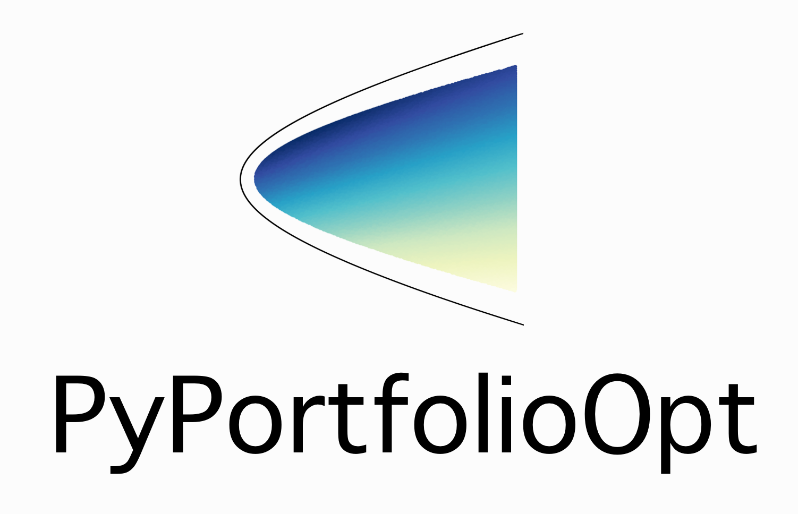

.. raw:: html

    <meta prefix="og: http://ogp.me/ns#" property="og:title" content="PyPortfolioOpt" />
    <meta prefix="og: http://ogp.me/ns#" property="og:description" content="Portfolio optimisation in python" />
    <meta prefix="og: http://ogp.me/ns#" property="og:image" content="https://github.com/robertmartin8/PyPortfolioOpt/blob/master/media/logo_v1.png"/>

    <embed>
        

             &nbsp;
             &nbsp;
             &nbsp;
             &nbsp;
        

    </embed>

PyPortfolioOpt is a library that implements portfolio optimisation methods, including
classical efficient frontier techniques and Black-Litterman allocation, as well as more
recent developments in the field like shrinkage and Hierarchical Risk Parity, along with
some novel experimental features like exponentially-weighted covariance matrices.

It is **extensive** yet easily
**extensible**, and can be useful for both the casual investor and the serious
practitioner. Whether you are a fundamentals-oriented investor who has identified a
handful of undervalued picks, or an algorithmic trader who has a basket of
interesting signals, PyPortfolioOpt can help you combine your alpha-generators
in a risk-efficient way.

Installation
============

Installation on macOS or linux is as simple as::

    pip install PyPortfolioOpt

Windows users need to go through the additional step of downloading C++ (for ``cvxpy``). You can
download this `here <https://visualstudio.microsoft.com/thank-you-downloading-visual-studio/?sku=BuildTools&rel=16>`_,
with additional instructions `here <https://drive.google.com/file/d/0B4GsMXCRaSSIOWpYQkstajlYZ0tPVkNQSElmTWh1dXFaYkJr/view>`_.

For the sake of best practice, it is good to do this with a dependency manager. I suggest you
set yourself up with `poetry <https://github.com/sdispater/poetry>`_, then within a new poetry project
run:

.. code-block:: text

    poetry add PyPortfolioOpt

The alternative is to clone/download the project, then in the project directory run

.. code-block:: text

    python setup.py install

Thanks to Thomas Schmelzer, PyPortfolioOpt now supports Docker (requires 
**make**, **docker**, **docker-compose**). Build your first container with 
``make build``; run tests with ``make test``. For more information, please read
`this guide <https://docker-curriculum.com/#introduction>`_.

.. note::
    If any of these methods don't work, please `raise an issue
    <https://github.com/robertmartin8/PyPortfolioOpt/issues>`_  on GitHub

For developers
--------------

If you are planning on using PyPortfolioOpt as a starting template for significant
modifications, it probably makes sense to clone this repository and to just use the
source code

.. code-block:: text

    git clone https://github.com/robertmartin8/PyPortfolioOpt

Alternatively, if you still want the convenience of ``from pypfopt import x``,
you should try

.. code-block:: text

    pip install -e git+https://github.com/robertmartin8/PyPortfolioOpt.git

A Quick Example
===============

This section contains a quick look at what PyPortfolioOpt can do. For a guided tour,
please check out the :ref:`user-guide`. For even more examples, check out the Jupyter
notebooks in the `cookbook <https://github.com/robertmartin8/PyPortfolioOpt/tree/master/cookbook>`_.

If you already have expected returns ``mu`` and a risk model ``S`` for your set of
assets, generating an optimal portfolio is as easy as::

    from pypfopt.efficient_frontier import EfficientFrontier

    ef = EfficientFrontier(mu, S)
    weights = ef.max_sharpe()

However, if you would like to use PyPortfolioOpt's built-in methods for
calculating the expected returns and covariance matrix from historical data,
that's fine too::

    import pandas as pd
    from pypfopt.efficient_frontier import EfficientFrontier
    from pypfopt import risk_models
    from pypfopt import expected_returns

    # Read in price data
    df = pd.read_csv("tests/resources/stock_prices.csv", parse_dates=True, index_col="date")

    # Calculate expected returns and sample covariance
    mu = expected_returns.mean_historical_return(df)
    S = risk_models.sample_cov(df)

    # Optimise for maximal Sharpe ratio
    ef = EfficientFrontier(mu, S)
    weights = ef.max_sharpe()
    ef.portfolio_performance(verbose=True)

This outputs the following:

.. code-block:: text

   Expected annual return: 33.0%
   Annual volatility: 21.7%
   Sharpe Ratio: 1.43

Contents
========

.. toctree::
    :maxdepth: 2

    UserGuide
    ExpectedReturns
    RiskModels
    EfficientFrontier
    BlackLitterman
    OtherOptimisers
    Postprocessing
    Plotting

.. toctree::
    :caption: Other information
    
    Roadmap
    Contributing
    About

Advantages over existing implementations
========================================

- Includes both classical methods (Markowitz 1952 and Black-Litterman), suggested best practices
  (e.g covariance shrinkage), along with many recent developments and novel
  features, like L2 regularisation, shrunk covariance, hierarchical risk parity.
- Native support for pandas dataframes: easily input your daily prices data.
- Extensive practical tests, which use real-life data.
- Easy to combine with your proprietary strategies and models.
- Robust to missing data, and price-series of different lengths (e.g FB data
  only goes back to 2012 whereas AAPL data goes back to 1980).

Project principles and design decisions
=======================================

- It should be easy to swap out individual components of the optimisation process
  with the user's proprietary improvements.
- Usability is everything: it is better to be self-explanatory than consistent.
- There is no point in portfolio optimisation unless it can be practically
  applied to real asset prices.
- Everything that has been implemented should be tested.
- Inline documentation is good: dedicated (separate) documentation is better.
  The two are not mutually exclusive.
- Formatting should never get in the way of good code: because of this,
  I have deferred **all** formatting decisions to `Black
  <https://github.com/ambv/black>`_.

Indices and tables
==================

* :ref:`genindex`
* :ref:`modindex`
* :ref:`search`
